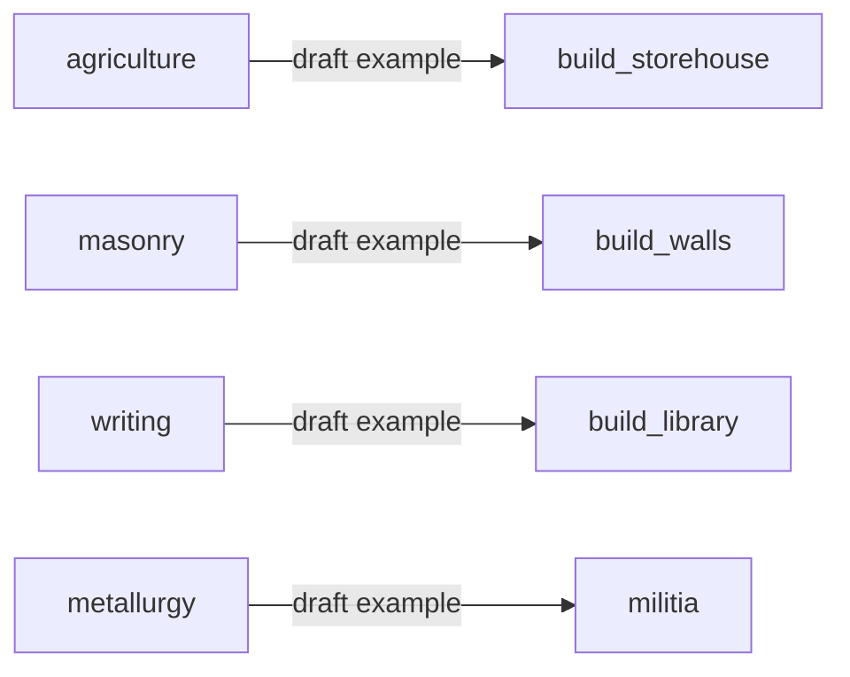

# Empire of Minds — Content backlog (Phase 3.0b)

## 1. Status and purpose

- This document is **exploratory and non-canonical**. It collects **candidate** content ideas; it is **not** the implementation contract.
- **[CONTENT_MODEL.md](CONTENT_MODEL.md)** remains the **authoritative** envelope for IDs, registries, and state-vs-definition rules. If anything here disagrees with `CONTENT_MODEL.md`, **`CONTENT_MODEL.md` wins.**
- Items below are **candidates only**. **Draft IDs** are brainstorming labels; they are **not** stable shipped IDs until a subphase promotes them into a registry and records the decision (typically [DECISION_LOG.md](DECISION_LOG.md)).
- **Balance**, exact **prerequisites**, **costs**, **strengths**, **eras**, and **final naming** are **deferred** to Phase **3.1–3.5** (shapes) and Phase **7** (tuning).
- **Theme-neutral** mechanical roles and generic draft IDs only here. **Phase 6** may rename or reframe these placeholders through Empire of Minds worldbuilding, display strings, and UI language.

## 2. How to read this backlog

- Each bullet uses a **draft ID** in backticks, matching [CONTENT_MODEL.md](CONTENT_MODEL.md): lowercase **`snake_case`**, ASCII, optional single **`:`** namespace where useful (e.g. `produce_unit:settler`).
- Tags per entry:
  - **Seed** — intended as a small first slice when that subphase lands (still draft until promoted).
  - **TBD** — placeholder slot for later design discussion.
  - **Long-horizon** — **not** Phase **3.1** scope; candidate-only for Phase **5+** / **7** unless explicitly pulled forward.
- **No numbers** (costs, yields, combat stats) in this doc.
- Promotion path: draft ID → validated against `CONTENT_MODEL.md` → added to a real `game/domain/content/*.gd` registry in the relevant subphase → tests updated.

## 3. Unit unlock candidates

### Phase 3.1 immediate seed subset (small first slice)

These six are **candidates** for the **first** unit-type registry slice in Phase **3.1** — **not** a commitment to implement all at once in one PR; order and grouping are TBD during implementation planning.

- **`settler`** — **Seed** — founds cities once Phase **3.1** gates **FoundCity** by type (see [UNITS.md](UNITS.md)).
- **`worker`** — **Seed** — civilian tile-improvement / economy role (**effects deferred** to Phase **5** / **7**).
- **`scout`** — **Seed** — light reconnaissance / exploration role (**rules deferred**).
- **`militia`** — **Seed** — basic cheap foot combat role (**combat deferred** to Phase **5**).
- **`archer`** — **Seed** — ranged foot role (**combat deferred**).
- **`rider`** — **Seed** — light mounted role (**combat / movement depth deferred**).

### Long-horizon military progression candidates (not Phase 3.1 scope)

**Explicit:** this list is **candidate-only**, **long-horizon**, and **not** part of Phase **3.1** scope unless a later steering decision pulls specific entries forward. It reflects a generic **era-style progression** (melee → materials → ranged → mounted → gunpowder → modern) without locking tech names, stats, or eras.

Draft IDs are **mechanical**; some overlap conceptually with the Phase **3.1** seed (`archer`, `rider` / mounted line) — when promoted, one ID should own each role.

- **`basic_melee`** — **Long-horizon** — basic melee infantry (candidate for “basic melee warrior” role).
- **`bronze_armed`** — **Long-horizon** — foot with early metal arms (candidate for “bronze-armed warrior” role).
- **`archer`** — **Long-horizon** — also listed under Phase **3.1** seed; same draft ID if the role is unified.
- **`composite_bow`** — **Long-horizon** — upgraded foot archer (candidate for “composite bow archer” role).
- **`iron_infantry`** — **Long-horizon** — stronger melee foot (candidate for “swordsman / iron infantry” style role).
- **`horseman`** — **Long-horizon** — mounted combat baseline (candidate for “horseman” role; distinct from **`rider`** if tuning needs two tiers).
- **`mounted_scout`** — **Long-horizon** — mounted reconnaissance (candidate for “mounted scout” role).
- **`crossbowman`** — **Long-horizon** — foot ranged with distinct mechanics (candidate for “crossbowman” role; **Phase 5** decides if distinct from **`archer`**).
- **`heavy_cavalry`** — **Long-horizon** — heavy mounted (candidate for “knight / heavy cavalry” style role; **no** unique-unit or civ-specific naming).
- **`steel_infantry`** — **Long-horizon** — later-era heavy foot (candidate for “steel infantry” role).
- **`musket_infantry`** — **Long-horizon** — early gunpowder foot (candidate for “musket infantry” role).
- **`rifle_infantry`** — **Long-horizon** — later gunpowder foot (candidate for “rifle infantry” role).
- **`sharpshooter`** — **Long-horizon** — specialized ranged foot (candidate for “sharpshooter” role).
- **`modern_armored`** — **Long-horizon** — modern armored role (candidate for “modern armor” style unit; **no** real-world vehicle naming).

**TBD (long-horizon slots)**

- **`naval_xx`** — **TBD** — naval roles (no draft ID finalized).
- **`siege_xx`** — **TBD** — siege / city-attack roles.
- **`civilian_xx`** — **TBD** — further civilian specialists beyond **`worker`**.

## 4. Building / city project candidates

**City project** draft IDs mix **`produce_unit:<unit_id>`** spawn projects (see [CONTENT_MODEL.md](CONTENT_MODEL.md)) and placeholder **`build_*`** in-place projects. The **`build_*` convention is draft** and may change in Phase **3.3**.

**Seed**

- **`produce_unit:settler`** — **Seed** — train a **`settler`** (mirrors examples in `CONTENT_MODEL.md`).
- **`produce_unit:worker`** — **Seed** — train a **`worker`**.
- **`build_storehouse`** — **Seed** — food / storage infrastructure (effects **TBD**, Phase **5** / **7**).
- **`build_training_ground`** — **Seed** — military training infrastructure (effects **TBD**).
- **`build_workshop`** — **Seed** — production infrastructure (effects **TBD**).
- **`build_library`** — **Seed** — science / knowledge infrastructure (effects **TBD**, ties Phase **3.4**).
- **`build_market`** — **Seed** — trade / economy infrastructure (effects **TBD**).
- **`build_walls`** — **Seed** — defensive infrastructure (effects **TBD**, Phase **5** combat).

**TBD**

- **`wonder_xx`** — **TBD** — one-of-a-kind projects (**Phase 5** candidate).
- **`district_xx`** — **TBD** — urban layout / multi-slot buildings (far horizon).

## 5. Science / progress candidates

**Seed** (generic role words, not a tech tree spec)

- **`agriculture`** — **Seed** — food / early economy unlocks.
- **`masonry`** — **Seed** — construction / early defense unlocks.
- **`writing`** — **Seed** — admin / science branch unlocks.
- **`currency`** — **Seed** — trade / economy branch unlocks.
- **`metallurgy`** — **Seed** — metal arms / armor branch unlocks.
- **`mathematics`** — **Seed** — abstract science / engineering branch unlocks.

**TBD**

- **`civic_xx`** — **TBD** — governance / policy-style progress.
- **`culture_xx`** — **TBD** — cultural / influence-style progress.

## 6. Unlock-chain examples

**Non-binding sketches only** — not a tech tree, not final prerequisites, not balance.

- **`currency`** → **`build_market`** (trade infrastructure) — example only.
- **`composite_bow`** or **`metallurgy`** → gate better ranged / melee units — example only; **Phase 5** owns combat matrix.

## 7. Design principles for logical unlocks

- Each unlock should eventually open a **meaningful decision** (avoid “auto-take” chains with no alternative).
- Early **prerequisite depth** should stay **shallow** (0–1 prereqs) so Phase **3.4** can ship a **small** slice.
- Prefer **branching** over mandatory **linear** historical chains so runs differ.
- Prerequisites must be **expressible as registry fields** so **`LegalActions`** and AI stay **deterministic**.
- **Draft → shipped:** a draft ID becomes **stable** only when its subphase lands; renames after shipping need **`DECISION_LOG.md`** and migration discipline per `CONTENT_MODEL.md`.
- Unlock **legality** should remain **headless-testable**; **balance** belongs in Phase **7**.

## 8. IP / originality guardrails

Per [PROJECT_BRIEF.md](PROJECT_BRIEF.md) **IP Boundary**:

- **No** Civilization (or other commercial game) **names**, **leaders**, **civ names**, **unique units**, **icons**, **UI layout**, or **exact tech-tree** cloning.
- **Generic** role words (`settler`, `agriculture`, `library`) are **scaffolding**, not branded content.
- **Display names** and flavor live in future registry fields and Phase **6** copy — **not** in draft IDs on this page.
- Avoid real-world **trademarked** vehicle or **faction** names in IDs or examples.

## 9. Phase mapping

- **Phase 3.1 — Unit definitions** — consumes **§3** Phase **3.1** seed subset first; long-horizon **§3** list is **input only** for later phases.
- **Phase 3.3 — City project definitions** — consumes **§4** seed projects; **`build_*` naming** may be revised when schemas are fixed.
- **Phase 3.4 — First tech / progress definitions** — consumes **§5** and optional **§6** examples; must stay a **thin** slice.
- **Phase 5 — Strategic dynamics** — may consume long-horizon **units**, combat meaning of **`militia`**, **`heavy_cavalry`**, etc., and defensive **`build_walls`** effects.
- **Phase 7 — Balance / content iteration** — owns **numbers**, **costs**, **timings**, and fine-grained **prerequisite graphs**; this backlog stays **non-canonical** reference input.

**Related canonical docs:** [PHASE_PLAN.md](PHASE_PLAN.md), [CONTENT_MODEL.md](CONTENT_MODEL.md), [UNITS.md](UNITS.md), [CITIES.md](CITIES.md), [AI_LAYER.md](AI_LAYER.md).
